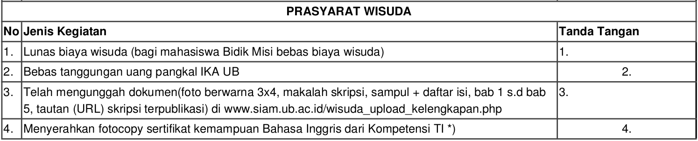

# Walkthrough Wisuda

1. Unggah kelengkapan berkas (yang nomor 3). Untuk file skripsi tidak ada
   ketentuan format.

2. Urus kartu alumni (yang nomor 2), dengan langkah-langkah:

    - Bayar iuran anggota alumni di Bank BTN UB (di pinggir jalan veteran dekat
      gerbang BNI) atau Bank BRI FEB UB sebesar Rp30.000. Simpan kwitansinya.
    - Ke Gedung IKA UB, kasih kwitansi pembayaran tadi, foto ijazah/foto kerja
      berwarna 1 lembar, dan form SC-18.
    - Isi form yang berikan oleh petugasnya.
    - Ambil lagi form SC-18nya (*pastikan sudah terstempel dan tertanda tangan*).

3. Ke kemahasiswaan lantai 6 (Mas Putra), kasih print screenshot tagihan SIAM
   terakhir yang sudah 0, fotocopy-an sertifikasi IT, fotocopy-an sertifikat
   TOEFL (kalau sertifnya belum, bisa pake surat sudah melaksanakan tes TOEFL
   yang dikasih setelah tes), dan form SC-18 untuk divalidasi dan ditanda tangan
   yang nomor 4.

4. Ke akademik lantai 6 (masuk lewat pintu samping ya, bukan di loket), siapkan
   form SC-18, SKL, dan nomor HP orang tua.

5. Ke kemahasiswaan lagi untuk cetak form validasi sembari memberikan form
   SC-18nya. Nantinya akan diberikan beberapa form, cek data-data yang tertera
   dan tanda tangani sesuai instruksi.

6. Kembali lagi ke akademik untuk memberikan form validasi.

7. Ukur toga di kemahasiswaan (lewat pintu samping, bukan loket). Nantinya akan
   diberikan kwitansi untuk pembayarannya.

8. Bawa form SC-18 dan kwitansi toga ke keuangan, bayar Rp135.000. Bawa lagi
   kwitansi dan form SC-18nya (*pastikan syarat wisuda yang nomor 1 di form SC-18
   sudah tertanda tangan*)

9. Kembali lagi ke kemahasiswaan, kasih kwitansinya.

10. Done! 🎉 Tinggal pantau [antrian wisudanya](http://filkom.ub.ac.id/page/read/informasi-wisuda/d628731dd1daa1).

